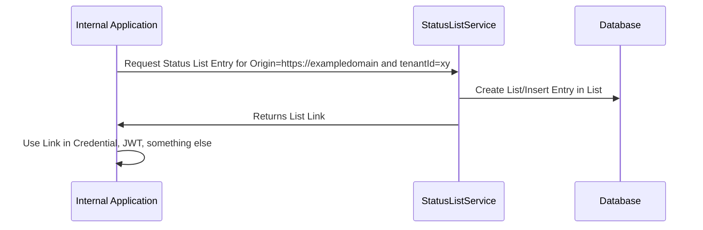
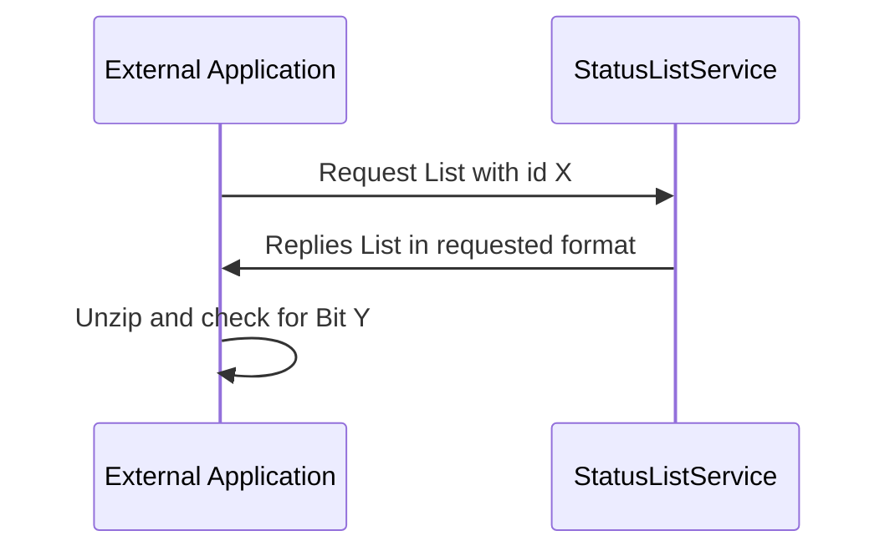

# Status List Service

## Introduction

The status list service implements the basis for realizing the basic concept of a bit string: 


This service can be used generically for expressing status lists with or without credentials with for kind of purpose. 

In the moment are various implementations out there: 

- [Bit String Status List](https://www.w3.org/TR/vc-bitstring-status-list)
- [JWT Status List](https://www.ietf.org/archive/id/draft-looker-oauth-jwt-cwt-status-list-01.txt) (Default)
- [VS Status List 2021](https://www.w3.org/TR/2023/WD-vc-status-list-20230427/)
- [Token Status List](https://www.ietf.org/id/draft-ietf-oauth-status-list-02.html)

In general all of them using the same basic concept of a single bit in a stream, so therefore the service it no adjusted to a special concept in the moment. This needs to be finally discussed and elected by the XFSC community.  

## Flow

### List Creation



### List Usage



## Dependencies

Mandatory: Postgres and Nats.

See [Docker Compose File](https://github.com/eclipse-xfsc/statuslist-service/-/raw/main/deployment/docker/docker-compose.yml?ref_type=heads)

Optional: Signer Service (in case for signed results)


## Bootstrap

1. Move to the compose file and start docker-compose up
2. Pull image from Habor
    ```
    docker pull node-654e3bca7fbeeed18f81d7c7.ps-xaas.io/ocm-wstack/status-list-service:main
    ```
3. Start docker image with the following environment parameters:
    -  STATUSLISTSERVICE_DATABASE_PARAMS: "sslmode:disable"

Database defaults are postgres:postgres (user:pw), and the standard ports.

Environment Variables:

|Variable|Purpose|Default|
|--------|-------|-------|
|STATUSLISTSERVICE_SIGNER_URL| Defines the signer url |signer|
|STATUSLISTSERVICE_SIGNER_TOPIC| Defines the signer messaging topic|signer|
|STATUSLISTSERVICE_LISTSIZEINBYTES| Defines the size of the list|1024|
|STATUSLISTSERVICE_NATS_URL|Nats Host|nats://localhost:4222|
|STATUSLISTSERVICE_NATS_QUEUE_GROUP|Nats Queue Group|-|
|STATUSLISTSERVICE_NATS_REQUEST_TIMEOUT|Request Timeout|-|
|STATUSLISTSERVICE_DATABASE_HOST|Postgres Host|localhost|
|STATUSLISTSERVICE_DATABASE_PORT|Postgres Port|5432|
|STATUSLISTSERVICE_DATABASE_DATABASE|Postgres DB|postgres|
|STATUSLISTSERVICE_DATABASE_USER|Postgres User|postgres|
|STATUSLISTSERVICE_DATABASE_PASSWORD|Postgres PW|postgres|
|STATUSLISTSERVICE_DATABASE_PARAMS|Postgres Params|postgres|


## Usage

See [Insomnia Collection](https://github.com/eclipse-xfsc/statuslist-service/-/raw/main/docs/insomnia.json?ref_type=heads)

In the call for Get Status List is the content type selecteable. Options: 

### Json Status List (statuslist+jwt)

Headers must be presented in call: X-KEY,X-DID, X-NAMESPACE.

JWT Token with Content (https://www.ietf.org/archive/id/draft-looker-oauth-jwt-cwt-status-list-01.html#section-4.2): 
```
{
  "typ": "statuslist+jwt",
  "alg": "ES256",
  "kid": "11"
},
{
  "iss": "https://example.com",
  "sub": "https://example.com/statuslists/1",
  "iat": 1683560915,
  "exp": 1686232115,
  "status_list": {
    "bits": 1,
    "lst": "H4sIAMo_jGQC_9u5GABc9QE7AgAAAA"
  }
}

```

### JSON (application/json)

```
{
	"list": "H4sIAAAAAAAA//o/CkbBKBixABAAAP//9P86uAAEAAA",
	"listId": 1,
	"tenantId": "123"
}
```


## Deployment

The postgres and nats must be deployed beforehand.

Override the settings under nginx.ingress.kubernetes.io/configuration-snippet according to your needs in the values yaml.

## Developer Information

By using this service the proper format of the final statuslist format must be choosen and properly signed (default is jwt). The service it self should not be directly public. The process of revoking is part of the business application.

### Nats Interface

The service listens on a Nats for [Statuslist Creation Requests](https://github.com/eclipse-xfsc/nats-message-library/-/raw/main/status.go?ref_type=heads) and returns with a reply of the statuslink which can be embedded in JWTs or credentials. 