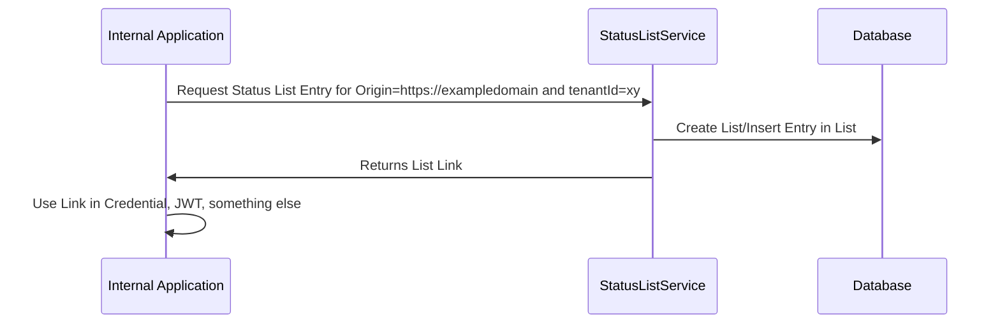
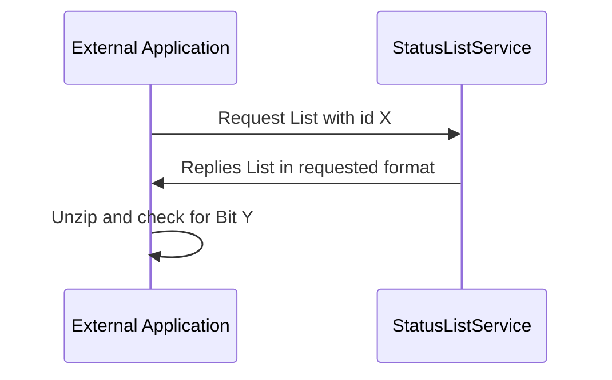

# Status List Service

## Introduction

The status list service implements the basis for realizing the basic concept of a bit string: 


This service can be used generically for expressing status lists with or without credentials with for kind of purpose. 

In the moment are various implementations out there: 

- [Bit String Status List](https://www.w3.org/TR/vc-bitstring-status-list)
- [JWT Status List](https://www.ietf.org/archive/id/draft-looker-oauth-jwt-cwt-status-list-01.txt) (Default)
- [VS Status List 2021](https://www.w3.org/TR/2023/WD-vc-status-list-20230427/)
- [Token Status List](https://www.ietf.org/id/draft-ietf-oauth-status-list-02.html)

In general all of them using the same basic concept of a single bit in a stream, so therefore the service it no adjusted to a special concept in the moment. This needs to be finally discussed and elected by the XFSC community.  

## Flow

### List Creation


```mermaid
sequenceDiagram
    Internal Application->>StatusListService: Request Status List Entry for Origin=https://exampledomain and tenantId=xy
    StatusListService->>Database: Create List/Insert Entry in List
    StatusListService->>Internal Application: Returns List Link
    Internal Application->>Internal Application: Use Link in Credential, JWT, something else
```

### List Usage


```mermaid
sequenceDiagram
    External Application ->> StatusListService: Request List with id X
    StatusListService->>External Application: Replies List in requested format 
    External Application->>External Application: Unzip and check for Bit Y
```

## Dependencies

Mandatory: Postgres and Nats.

See [Docker Compose File](https://github.com/eclipse-xfsc/statuslist-service/-/raw/main/deployment/docker/docker-compose.yml?ref_type=heads)

Optional: Signer Service (in case for signed results)


## Bootstrap

1. Move to the compose file and start docker-compose up
2. Pull image from Habor
    ```
    docker pull node-654e3bca7fbeeed18f81d7c7.ps-xaas.io/ocm-wstack/status-list-service:main
    ```
3. Start docker image with the following environment parameters:
    -  STATUSLISTSERVICE_DATABASE_PARAMS: "sslmode:disable"

Database defaults are postgres:postgres (user:pw), and the standard ports.

Environment Variables:

|Variable|Purpose|Default|
|--------|-------|-------|
|STATUSLIST_SIGNER_URL| Defines the signer url |signer|
|STATUSLIST_SIGNER_TOPIC| Defines the signer messaging topic|signer|
|STATUSLIST_LISTSIZEINBYTES| Defines the size of the list|1024|
|STATUSLIST_NATS_URL|Nats Host|nats://localhost:4222|
|STATUSLIST_NATS_QUEUE_GROUP|Nats Queue Group|-|
|STATUSLIST_NATS_REQUEST_TIMEOUT|Request Timeout|-|
|STATUSLIST_DATABASE_HOST|Postgres Host|localhost|
|STATUSLIST_DATABASE_PORT|Postgres Port|5432|
|STATUSLIST_DATABASE_DATABASE|Postgres DB|postgres|
|STATUSLIST_DATABASE_USER|Postgres User|postgres|
|STATUSLIST_DATABASE_PASSWORD|Postgres PW|postgres|
|STATUSLIST_DATABASE_PARAMS|Postgres Params|postgres|


## Usage

See [Insomnia Collection](https://github.com/eclipse-xfsc/statuslist-service/-/raw/main/docs/insomnia.json?ref_type=heads)

In the call for Get Status List is the content type selecteable. Options: 

### Json Status List (statuslist+jwt)

Headers must be presented in call: X-KEY,X-DID, X-NAMESPACE.

JWT Token with Content (https://www.ietf.org/archive/id/draft-looker-oauth-jwt-cwt-status-list-01.html#section-4.2): 
```
{
  "typ": "statuslist+jwt",
  "alg": "ES256",
  "kid": "11"
},
{
  "iss": "https://example.com",
  "sub": "https://example.com/statuslists/1",
  "iat": 1683560915,
  "exp": 1686232115,
  "status_list": {
    "bits": 1,
    "lst": "H4sIAMo_jGQC_9u5GABc9QE7AgAAAA"
  }
}

```

### JSON (application/json)

```
{
	"list": "H4sIAAAAAAAA//o/CkbBKBixABAAAP//9P86uAAEAAA",
	"listId": 1,
	"tenantId": "123"
}
```


## Deployment

The postgres and nats must be deployed beforehand.

Override the settings under nginx.ingress.kubernetes.io/configuration-snippet according to your needs in the values yaml.

## Developer Information

By using this service the proper format of the final statuslist format must be choosen and properly signed (default is jwt). The service it self should not be directly public. The process of revoking is part of the business application.

### Nats Interface

The service listens on a Nats for [Statuslist Creation Requests](https://github.com/eclipse-xfsc/nats-message-library/-/raw/main/status.go?ref_type=heads) and returns with a reply of the statuslink which can be embedded in JWTs or credentials. 

# Multi-Tenancy

The Status List Service is designed as a tenant-aware infrastructure component. Every status list belongs to exactly one tenant and is isolated at the persistence and signing layers.

## Tenant Resolution

Unlike the messaging API, the REST API does not expose the tenant identifier as part of the URL.

Instead, the tenant is supplied through an HTTP request header:
```
X-Tenant-Id: tenant-a
```
Example:
```
GET /status/42
X-Tenant-Id: tenant-a
Accept: application/vc+ld+json
```
This is an intentional architectural decision.

The assumption is that tenant onboarding, DNS management, TLS certificates, and ingress routing are handled by a dedicated Tenant Management component. That component owns the public domains of the tenants and configures the ingress controller (or API gateway) accordingly.

A typical deployment looks like this:
```
Tenant Management
        │
        ▼
tenant.example.com
        │
        ▼
Ingress / Gateway
        │ injects X-Tenant-Id
        ▼
Status List Service
```
Because the ingress already knows which tenant owns a particular hostname, it can inject the correct X-Tenant-Id header before forwarding the request to the Status List Service.

This provides several advantages:

* REST endpoints remain stable (/status/{listId}).
* Tenant information cannot be manipulated through URL paths.
* DNS, routing, and tenant ownership are managed in a single place.
* Multiple services can share the same tenant resolution mechanism.
* Internal services only operate on an authenticated tenant context.

## Messaging API

For NATS-based communication, the tenant identifier is carried inside the message payload (tenantId) because there is no HTTP gateway responsible for tenant resolution.

## Security Considerations

The Status List Service trusts the injected tenant header only when requests originate from the configured ingress or API gateway. The service is therefore intended to be deployed behind a trusted reverse proxy and should not be exposed directly to the public Internet without appropriate authentication and header validation.


# Makefile Commands

The project includes a Makefile for common development, testing, Goa generation, Docker Compose, and mock workflows.

## Goa Code Generation

Generates the Goa transport and endpoint code from design/design.go.
```
make goa-gen
```
Removes the generated Goa output and regenerates it.
```
make goa-regenerate
```

## Development

These commands format the code, run tests, build the service, or start the service locally.

```
make fmt
make test
make build
make run
```

## Docker Compose

These commands start, stop, restart, inspect logs, or fully clean the local Docker Compose environment.

```
make compose-up
make compose-down
make compose-restart
make compose-logs
make compose-clean
```


Database shell:

```
make db-shell
```
NATS shell:
```
make nats-shell
```
## Mock Status List Creation

The mock client creates status list entries over NATS and prints the returned status list URL.
```
make mock-create-bitstring
make mock-create-statuslist2021
```
Create multiple entries:
```
make mock-create-many-bitstring
make mock-create-many-statuslist2021
```
The mock supports all configured list types:
```
make mock-create-bitstring-list
make mock-create-statuslist2021-credential
```
### Fetch Status Lists

The REST API expects the tenant to be injected via header:
```
X-Tenant-Id: tenant-a
```
Fetch the technical JSON representation:
```
make get-status-json LIST_ID=1 TENANT_ID=tenant-a
```
Fetch the VC-LD representation:
```
make get-status-vcld LIST_ID=1 TENANT_ID=tenant-a
```
Fetch the JWT representation:
```
make get-status-jwt LIST_ID=1 TENANT_ID=tenant-a
```
You can override the service URL:
```
make get-status-json SERVICE_URL=http://localhost:8080 TENANT_ID=tenant-a LIST_ID=1
```