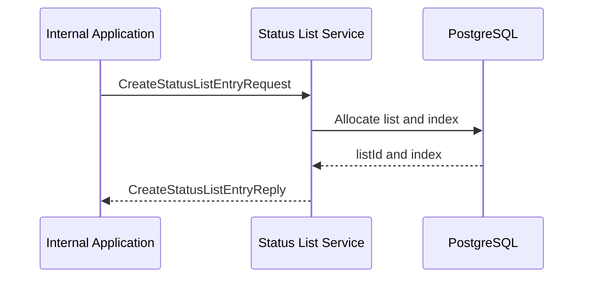
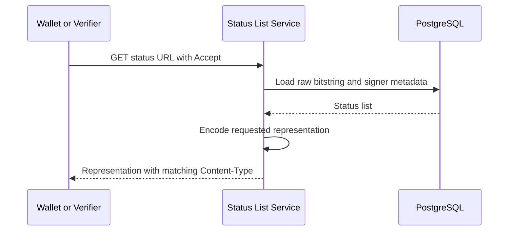

# Status List Service

The Status List Service manages tenant-scoped bitstring status lists for credentials and token-based credential formats.

The service provides:

- status-list entry allocation through NATS request/reply,
- persistent status-list storage in PostgreSQL,
- retrieval through HTTP,
- revocation of individual entries,
- signed IETF Token Status List JWT responses,
- W3C Bitstring Status List credentials,
- legacy W3C Status List 2021 credentials,
- a technical JSON representation for internal and diagnostic use.

PostgreSQL and NATS are mandatory dependencies. A signer service is required for signed representations.

## Supported Formats

The service uses a common internal bitstring, but the external representations are not interchangeable. Compression, media type, document structure, and signing requirements depend on the selected representation.

| Representation | Media Type | Structure | Compression |
| --- | --- | --- | --- |
| IETF Token Status List | `application/statuslist+jwt` | Compact JWT | ZLIB/DEFLATE |
| W3C Bitstring Status List | `application/vc+ld+json` | VC with `BitstringStatusListCredential` | GZIP |
| W3C Status List 2021 | `application/vc+ld+json` | VC with `StatusList2021Credential` | GZIP |
| Technical JSON | `application/json` | XFSC internal representation | Representation-specific encoded list |

The status-list type stored with the list determines which VC structure is produced for `application/vc+ld+json`.

Supported type values are:

```text
BitstringStatusListCredential
BitstringStatusList
StatusList2021Credential
StatusList2021
```

If no type is supplied, the current default is:

```text
StatusList2021
```

## IETF Token Status List

The IETF Token Status List representation is returned as a raw compact JWT.

Request:

```http
GET /v1/tenants/{tenantId}/status/{listId}
Accept: application/statuslist+jwt
```

Response:

```http
HTTP/1.1 200 OK
Content-Type: application/statuslist+jwt
```

The response body is the compact token itself:

```text
eyJ...eyJ...signature
```

It is not wrapped in JSON and must not be returned as a quoted JSON string.

A typical JOSE header is:

```json
{
  "alg": "ES256",
  "kid": "did:web:issuer.example#key-1",
  "typ": "statuslist+jwt"
}
```

A typical payload is:

```json
{
  "iss": "https://issuer.example/v1/tenants/example/status",
  "sub": "https://issuer.example/v1/tenants/example/status/2",
  "iat": 1788681256,
  "exp": 1820217256,
  "status_list": {
    "bits": 1,
    "lst": "eJ..."
  }
}
```

For this representation:

- `typ` is `statuslist+jwt`.
- `sub` identifies the concrete public status-list resource.
- `status_list.bits` defines the number of bits per status value.
- `status_list.lst` contains the compressed status list.
- the status list is compressed using DEFLATE with the ZLIB data format.
- the compressed data is encoded using base64url without padding.
- status values are interpreted least-significant-bit first within a byte.

The Token Status List representation must not use the GZIP encoder used by the W3C credential representations.

## W3C Bitstring Status List

The service supports the W3C Bitstring Status List credential structure through the following stored list types:

```text
BitstringStatusListCredential
BitstringStatusList
```

Request:

```http
GET /v1/tenants/{tenantId}/status/{listId}
Accept: application/vc+ld+json
```

For a Bitstring Status List, the resulting credential has the structure:

```json
{
  "@context": [
    "https://www.w3.org/ns/credentials/v2",
    "https://www.w3.org/ns/credentials/status/v1"
  ],
  "id": "https://issuer.example/v1/tenants/example/status/2",
  "type": [
    "VerifiableCredential",
    "BitstringStatusListCredential"
  ],
  "issuer": "did:web:issuer.example",
  "validFrom": "2026-09-06T08:00:00Z",
  "credentialSubject": {
    "id": "https://issuer.example/v1/tenants/example/status/2#list",
    "type": "BitstringStatusList",
    "statusPurpose": "revocation",
    "encodedList": "H4sI..."
  }
}
```

The W3C Bitstring Status List representation uses `credentialSubject.encodedList`.

Its bitstring compression is GZIP. It therefore has a different encoding path from the IETF Token Status List representation.

Typical base64url-encoded GZIP data starts with a value corresponding to the GZIP magic bytes `1f 8b`, often visible as a prefix such as:

```text
H4sI...
```

The service must keep this encoder separate from the ZLIB encoder used for `status_list.lst` in an IETF Token Status List.

## W3C Status List 2021

The legacy Status List 2021 representation remains supported through:

```text
StatusList2021Credential
StatusList2021
```

When no explicit list type is supplied, `StatusList2021` is currently used as the default.

Request:

```http
GET /v1/tenants/{tenantId}/status/{listId}
Accept: application/vc+ld+json
```

A Status List 2021 response has the structure:

```json
{
  "@context": [
    "https://www.w3.org/2018/credentials/v1",
    "https://w3id.org/vc/status-list/2021/v1"
  ],
  "id": "https://issuer.example/v1/tenants/example/status/2",
  "type": [
    "VerifiableCredential",
    "StatusList2021Credential"
  ],
  "issuer": "did:web:issuer.example",
  "issuanceDate": "2026-09-06T08:00:00Z",
  "credentialSubject": {
    "id": "https://issuer.example/v1/tenants/example/status/2#list",
    "type": "StatusList2021",
    "statusPurpose": "revocation",
    "encodedList": "H4sI..."
  }
}
```

Status List 2021 also uses a GZIP-compressed `credentialSubject.encodedList`.

This format is retained for backwards compatibility and must not share the IETF Token Status List ZLIB encoder.

## Technical JSON Representation

The service also exposes a technical JSON representation.

Request:

```http
GET /v1/tenants/{tenantId}/status/{listId}
Accept: application/json
```

Example:

```json
{
  "listId": 2,
  "type": "BitstringStatusListCredential",
  "purpose": "revocation",
  "list": "..."
}
```

This representation is intended for service integration, diagnostics, and internal processing. It is not a replacement for the standard Token Status List or VC status-list representations.

Consumers should explicitly request one of the standard representations when interoperating with external wallets or verifiers.

## Representation and Compression Separation

The service maintains one logical status bitstring, but encoding must happen after the requested representation is known.

The intended separation is:

```text
raw database bitstring
        |
        +--> IETF Token Status List
        |       |
        |       +--> ZLIB/DEFLATE
        |       +--> base64url without padding
        |       +--> status_list.lst
        |       +--> compact signed JWT
        |
        +--> W3C Bitstring Status List
        |       |
        |       +--> GZIP
        |       +--> base64url
        |       +--> credentialSubject.encodedList
        |       +--> BitstringStatusListCredential
        |
        +--> W3C Status List 2021
                |
                +--> GZIP
                +--> base64url
                +--> credentialSubject.encodedList
                +--> StatusList2021Credential
```

A single encoder must not be used for all three standards.

In particular:

```text
IETF Token Status List    -> ZLIB
W3C Bitstring Status List -> GZIP
W3C Status List 2021      -> GZIP
```

## Flow

### Status List Entry Allocation

Status-list entries are allocated through NATS.


```mermaid
sequenceDiagram
    Internal Application->>Status List Service: CreateStatusListEntryRequest
    Status List Service->>PostgreSQL: Allocate list and index
    PostgreSQL-->>Status List Service: listId and index
    Status List Service-->>Internal Application: CreateStatusListEntryReply
```

The reply contains the allocated list ID, index, status-list URL, purpose, and type.

The returned status URL is intended to be embedded into the credential.

Example:

```text
https://issuer.example/v1/tenants/example/status/2
```

### Credential Reference

An SD-JWT VC using an IETF Token Status List can reference an entry as:

```json
{
  "status": {
    "status_list": {
      "idx": 3,
      "uri": "https://issuer.example/v1/tenants/example/status/2"
    }
  }
}
```

### Status List Retrieval


```mermaid
sequenceDiagram
    Wallet or Verifier->>Status List Service: GET status URL with Accept
    Status List Service->>PostgreSQL: Load raw bitstring and signer metadata
    PostgreSQL-->>Status List Service: Status list
    Status List Service->>Status List Service: Encode requested representation
    Status List Service-->>Wallet or Verifier: Representation with matching Content-Type
```

HTTP representation selection uses the request `Accept` header.

The response `Content-Type` describes the selected representation.

A GET request must not use request `Content-Type` to select the response format.

## HTTP API

### Health

```http
GET /health
```

### Get Status List

```http
GET /v1/tenants/{tenantId}/status/{listId}
```

Path parameters:

```text
tenantId
listId
```

Optional headers include:

```http
Accept: application/statuslist+jwt
X-Group-Id: group-a
```

Supported response selection:

```text
Accept: application/statuslist+jwt
    -> IETF Token Status List JWT

Accept: application/vc+ld+json
    -> W3C credential representation selected by stored list type

Accept: application/json
    -> technical JSON representation
```

### Revoke Entry

```http
POST /status/{tenantId}/{listId}/revoke/{index}
```

The endpoint updates the specified status-list entry.

## NATS Interface

The service listens for status-list creation and verification requests using the XFSC CloudEvent/NATS infrastructure.

### Creation

A creation request contains status-list and signer metadata such as:

```text
tenantId
requestId
origin
key
did
namespace
group
type
purpose
expirationDate
```

The public `origin` is used when constructing the returned status-list URL.

For example:

```text
origin:
https://issuer.example/v1/tenants/example/status

listId:
2

statusUrl:
https://issuer.example/v1/tenants/example/status/2
```

### Verification

The verification flow retrieves the status list from the supplied `statusUrl`, verifies the signed representation where required, decompresses the encoded status list, caches the raw bitstring, and evaluates the requested index.

The decompression algorithm must match the retrieved representation:

```text
Token Status List JWT     -> decode status_list.lst with ZLIB
Bitstring Status List VC  -> decode credentialSubject.encodedList with GZIP
Status List 2021 VC       -> decode credentialSubject.encodedList with GZIP
```

The HTTP request should use `Accept` to request the required representation.

## Multi-Tenancy

Every persisted status list belongs to a tenant.

The current retrieval route carries the tenant identifier in the URL:

```http
GET /v1/tenants/{tenantId}/status/{listId}
```

NATS requests carry the tenant identifier in their message payload.

Signing metadata can additionally contain group, namespace, DID, and key references.

## Configuration

Configuration is read from environment variables using the `STATUSLIST_` prefix.

Important settings include:

| Variable | Purpose |
| --- | --- |
| `STATUSLIST_SIGNER_URL` | Signer service URL |
| `STATUSLIST_SIGNER_TOPIC` | Signer messaging topic |
| `STATUSLIST_LISTSIZEINBYTES` | Size of newly created lists |
| `STATUSLIST_NATS_URL` | NATS server URL |
| `STATUSLIST_NATS_QUEUE_GROUP` | NATS queue group |
| `STATUSLIST_NATS_REQUEST_TIMEOUT` | NATS request timeout |
| `STATUSLIST_DATABASE_HOST` | PostgreSQL host |
| `STATUSLIST_DATABASE_PORT` | PostgreSQL port |
| `STATUSLIST_DATABASE_DATABASE` | PostgreSQL database |
| `STATUSLIST_DATABASE_USER` | PostgreSQL user |
| `STATUSLIST_DATABASE_PASSWORD` | PostgreSQL password |
| `STATUSLIST_DATABASE_PARAMS` | Additional PostgreSQL connection parameters |
| `STATUSLIST_DEFAULT_LISTTYPE` | Default status-list type |

The authoritative configuration structure and defaults are defined in:

```text
internal/config
```

## Goa HTTP Transport

The REST API is generated with Goa.

Generated files are located below:

```text
gen/
```

Do not edit generated files manually.

Generate the HTTP transport with:

```bash
goa gen github.com/eclipse-xfsc/statuslist-service/design
```

or:

```bash
make goa-gen
```

To regenerate from scratch:

```bash
make goa-regenerate
```

### Response Encoding

The generated Goa response code creates the response encoder before committing the HTTP status:

```go
enc := encoder(ctx, w)
body := res
w.WriteHeader(http.StatusOK)
return enc.Encode(body)
```

Headers that must be present on the wire therefore need to be set before `WriteHeader`.

For an IETF Token Status List response, the encoder factory sets:

```go
w.Header().Set("Content-Type", "application/statuslist+jwt")
```

before the generated Goa code calls:

```go
w.WriteHeader(http.StatusOK)
```

The JWT body encoder then writes only the raw compact token.

This prevents Go from automatically committing:

```http
Content-Type: text/plain; charset=utf-8
```

for the compact JWT response.

## Development

Requirements:

```text
Go
PostgreSQL
NATS
Signer service or signer mock
Goa CLI for regeneration
```

Common commands:

```bash
make fmt
make test
make build
make run
```

Docker Compose:

```bash
make compose-up
make compose-down
make compose-restart
make compose-logs
make compose-clean
```

Database shell:

```bash
make db-shell
```

NATS shell:

```bash
make nats-shell
```

## Mock Status List Creation

Create W3C Bitstring Status List entries:

```bash
make mock-create-bitstring
```

Create legacy Status List 2021 entries:

```bash
make mock-create-statuslist2021
```

Create multiple entries:

```bash
make mock-create-many-bitstring
make mock-create-many-statuslist2021
```

Additional configured aliases:

```bash
make mock-create-bitstring-list
make mock-create-statuslist2021-credential
```

## Fetch Status Lists

Fetch the technical JSON representation:

```bash
make get-status-json LIST_ID=1 TENANT_ID=tenant-a
```

Fetch the VC representation:

```bash
make get-status-vcld LIST_ID=1 TENANT_ID=tenant-a
```

Fetch the IETF Token Status List JWT:

```bash
make get-status-jwt LIST_ID=1 TENANT_ID=tenant-a
```

Equivalent Token Status List request:

```bash
curl -i \
  -H 'Accept: application/statuslist+jwt' \
  http://localhost:8080/v1/tenants/tenant-a/status/1
```

Expected response headers:

```http
HTTP/1.1 200 OK
Content-Type: application/statuslist+jwt
```

## Testing

Token Status List tests should verify:

- raw compact JWT response,
- `Content-Type: application/statuslist+jwt`,
- `typ: statuslist+jwt`,
- signing algorithm and `kid`,
- `sub` equals the concrete public status-list URL,
- `status_list.bits`,
- base64url without padding,
- ZLIB decompression,
- rejection of GZIP for the IETF representation,
- least-significant-bit-first status interpretation,
- initial status value,
- revoked status value.

W3C Bitstring Status List tests should verify:

- VC v2 context,
- `BitstringStatusListCredential`,
- `BitstringStatusList`,
- `statusPurpose`,
- `credentialSubject.encodedList`,
- GZIP compression.

Status List 2021 tests should verify:

- VC v1 context,
- `StatusList2021Credential`,
- `StatusList2021`,
- `statusPurpose`,
- `credentialSubject.encodedList`,
- GZIP compression.

Integration tests should verify the full HTTP pipeline rather than only the body encoder so that committed response headers are covered.

## References

- IETF Token Status List  
  https://datatracker.ietf.org/doc/draft-ietf-oauth-status-list/

- W3C Bitstring Status List  
  https://www.w3.org/TR/vc-bitstring-status-list/

- W3C Status List 2021  
  https://w3c-ccg.github.io/vc-status-list-2021/

- Goa HTTP Guide  
  https://goa.design/docs/1-goa/http-guide/

## License

Apache License 2.0. See `LICENSE`.
